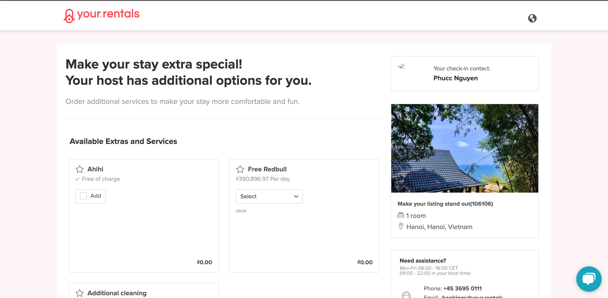
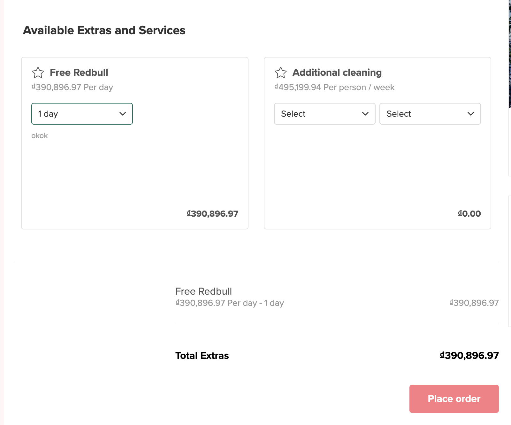
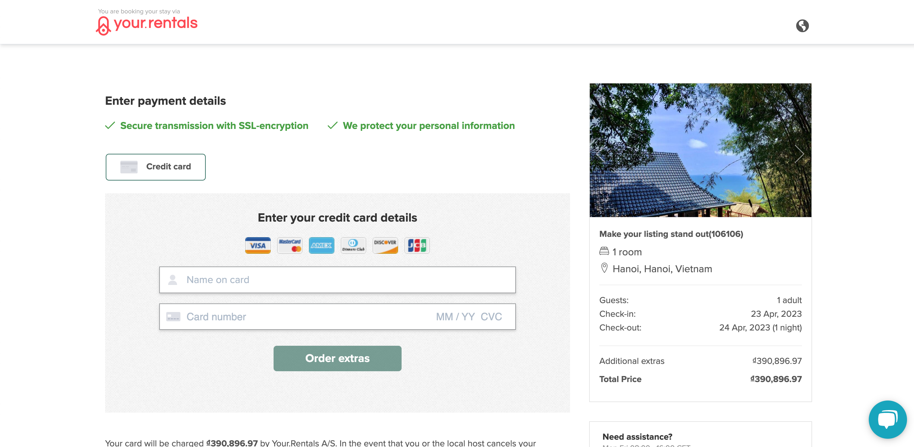
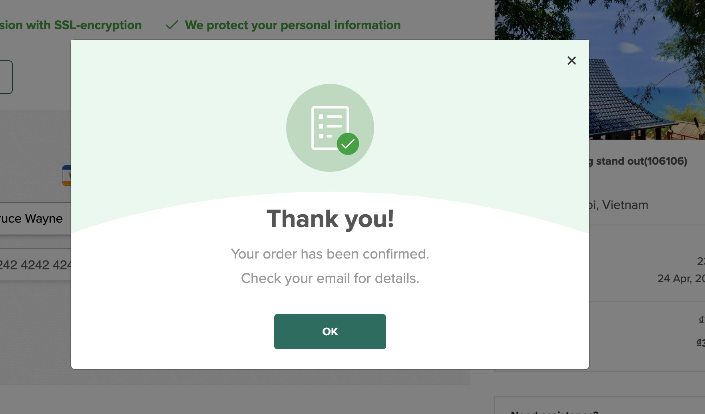
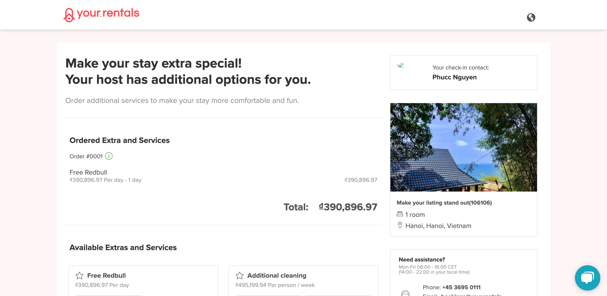

# Overview

This page will describe how Guest be able to order extra service definition from Property

---

# How Guest can order extras

Guest can only order extras services when the booking has these conditions:

- Has sales channel is **Direct Booking channel**
- Booking is in confirmed states: **Confirmed, In Progress, Cool Off, Completed, Dispute By Pm, Dispute By Guest, Pending Cancellation**

The only place guest can order extra services at the moment is via Upselling pages.

In this Upselling Pages, all the Extra Service Definitions which are associated with the listing of booking will be display as available options for Guest.

---

# The Process of Ordering Extra Services

1. Guest selects the wanted extra service orders. In this step, after each time Guest change the quantity of Extra Services, the new total amount of the order will be updated.
   

2. Guest press the **Place order** button and will be navigated to Extra Payment page
   

3. Guest enter card information and press **Order extra**. System will process their card and show a confirmation modal to the Guest
   

4. Guest press OK button and redirect back to Upselling Pages. The page will show the ordered extras to the guest.
   
   **Notes**:

- The guest cannot cancel extras that they ordered at the first release.
- The Upselling page will show all the Guest's extra orders regardless of the payment status. In the past, we only show the orders which are successfully paid but that's no longer the case.
- Each order will be shown with the currency which the Guest used to orders. In the previous version, we allow Guest to change currency between each order which lead to a lots of bugs for us to trace back the currency trail for the order value. So for now, we will restrict this to show the total amount of each other with each currency. In other words, all detail of each order cannot be modified.

5. After each success paid order, system will send email to both Guest and Property Manager to notify them about the order. For Guest, we use template 32. For Property Manager, we use template 31.
