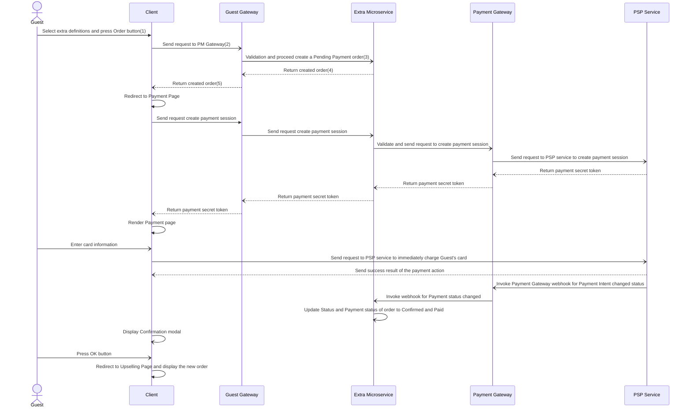

# Overview

This page will describe how System process the payment flow under the hood.

```mermaid
 sequenceDiagram
 actor Guest
 participant Client
 participant Guest Gateway
 participant Extra Microservice
 participant Payment Gateway
 participant PSP Service
      Guest->>Client: Select extra definitions and press Order button(1)
      Client -) Guest Gateway: Send request to PM Gateway(2)
      Guest Gateway -) Extra Microservice: Validation and proceed create a Pending Payment order(3)
      Extra Microservice --) Guest Gateway: Return created order(4)
      Guest Gateway --) Client: Return created order(5)
      Client ->> Client: Redirect to Payment Page
      Client ->> Guest Gateway: Send request create payment session
      Guest Gateway -) Extra Microservice: Send request create payment session
      Extra Microservice -) Payment Gateway: Validate and send request to create payment session
      Payment Gateway -) PSP Service: Send request to PSP service to create payment session
      PSP Service --) Payment Gateway: Return payment secret token
      Payment Gateway --) Extra Microservice: Return payment secret token
      Extra Microservice --) Guest Gateway: Return payment secret token
      Guest Gateway --) Client: Return payment secret token
      Client ->> Client: Render Payment page
      Guest -) Client: Enter card information
      Client -) PSP Service: Send request to PSP service to immediately charge Guest's card
      PSP Service --) Client: Send success result of the payment action
      PSP Service -) Payment Gateway: Invoke Payment Gateway webhook for Payment Intent changed status
      Payment Gateway -) Extra Microservice: Invoke webhook for Payment status changed
      Extra Microservice -) Extra Microservice: Update Status and Payment status of order to Confirmed and Paid
      Client -) Client: Display Confirmation modal
      Guest -) Client: Press OK button
      Client ->> Client: Redirect to Upselling Page and display the new order
```
